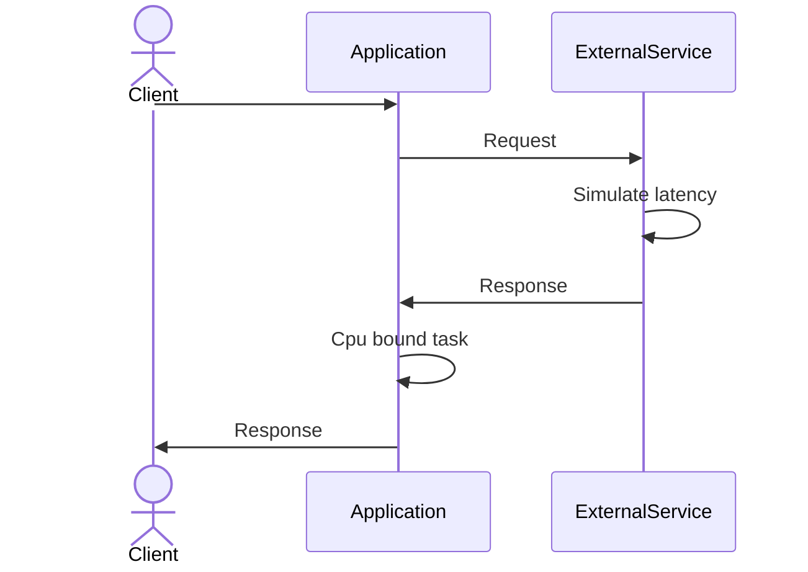
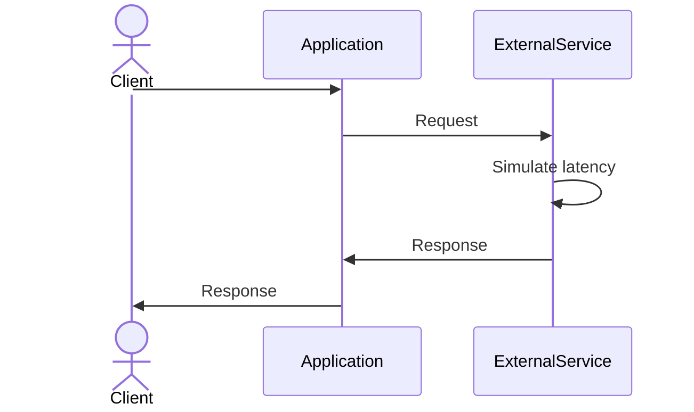
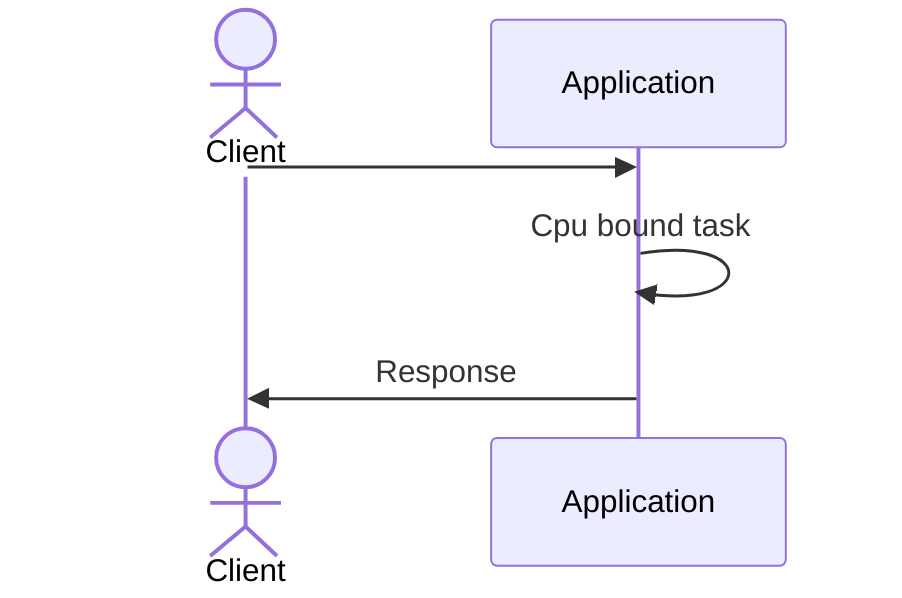

# Benchmark

### Case one

```mermaid
sequenceDiagram
    actor Client
    Client->>Application: 
    Application->>ExternalService: Request
    ExternalService->>ExternalService: Simulate latency
    ExternalService->>Application: Response
    Application->>Application: Cpu bound task
    Application->>Client: Response
```

### Case two

```mermaid
sequenceDiagram
    actor Client
    Client->>Application: 
    Application->>ExternalService: Request
    ExternalService->>ExternalService: Simulate latency
    ExternalService->>Application: Response
    Application->>Client: Response
```

### Case three

```mermaid
sequenceDiagram
    actor Client
    Client->>Application:     
    Application->>Application: Cpu bound task
    Application->>Client: Response
```
